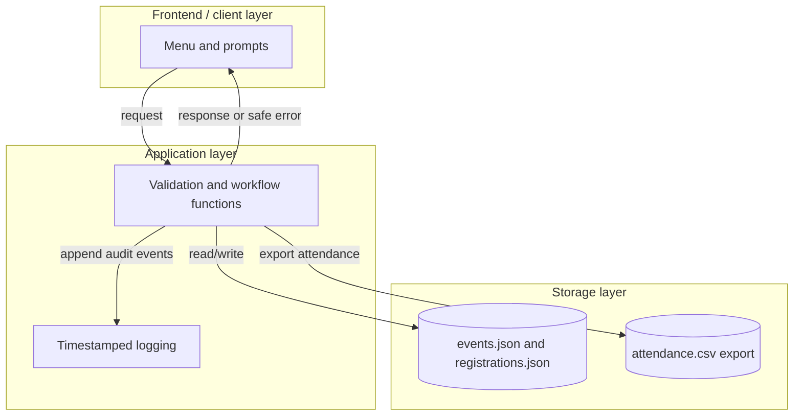
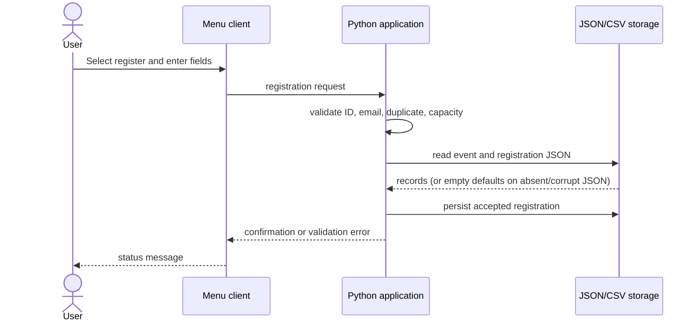

# Exercise 1.1 — Architecture and flow

```mermaid
flowchart TB
  subgraph Client[Frontend / client layer]
    M[Menu and prompts]
  end
  subgraph App[Application layer]
    V[Validation and workflow functions]
    L[Timestamped logging]
  end
  subgraph Store[Storage layer]
    J[(events.json and registrations.json)]
    C[(attendance.csv export)]
  end
  M -->|request| V
  V -->|read/write| J
  V -->|append audit events| L
  V -->|export attendance| C
  V -->|response or safe error| M
```

```mermaid
sequenceDiagram
  actor User
  participant UI as Menu client
  participant App as Python application
  participant Files as JSON/CSV storage
  User->>UI: Select register and enter fields
  UI->>App: registration request
  App->>App: validate ID, email, duplicate, capacity
  App->>Files: read event and registration JSON
  Files-->>App: records (or empty defaults on absent/corrupt JSON)
  App->>Files: persist accepted registration
  App-->>UI: confirmation or validation error
  UI-->>User: status message
```

Run `python app.py` from this folder. IDs use `P` plus four digits; all example people and addresses are fictional.
